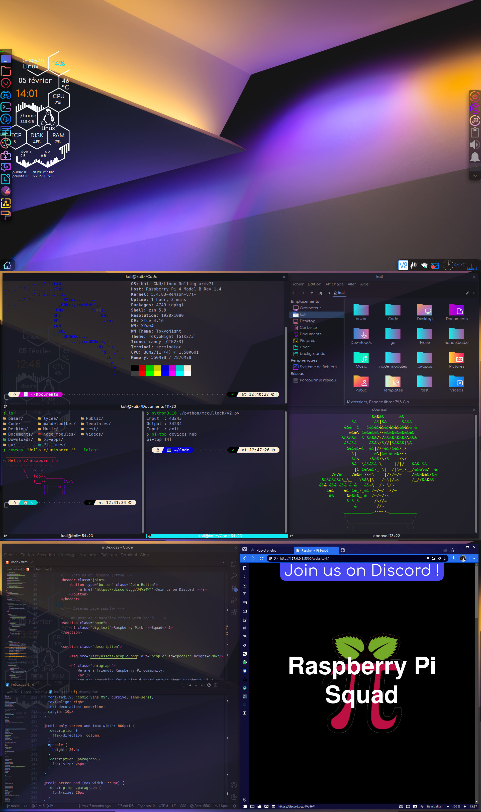
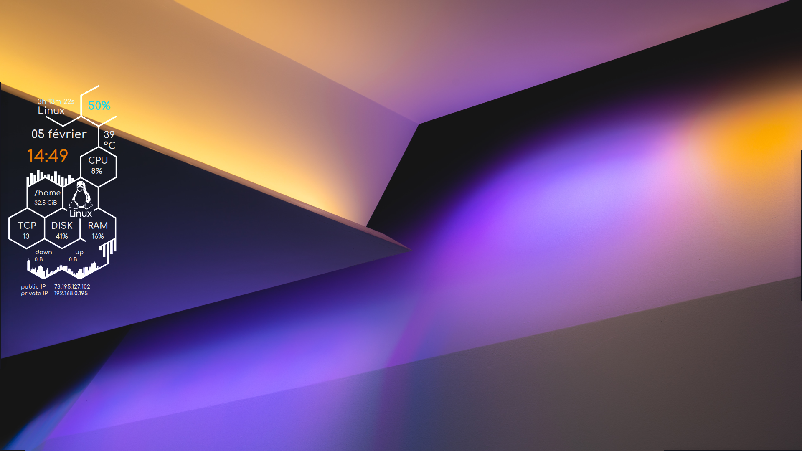

# dotfiles

As it is written in the Zen of Python :
> Beautiful is better than ugly.
> 
> Explicit is better than implicit.
> 
> Simple is better than complex.
> 
> Complex is better than complicated.

This is my attempt to create a rice following these concepts.

# Screenshots


The panels are automatically hidden :


# Note

I use a Raspberry Pi 4 with a [pi-top [4] DIY Edition](https://www.pi-top.com/products/diy-edition) and things may differ for you. In addition, I managed to make the compatibility between Kali and the hardware - I may create a guide or contact the pi-top team to share how I did it. Thus, for instance, I use `pi-top battery -c` to get the capacity of the battery but you have to change it.

My OS is Kali not because it is designed for pentesting but because the packages are more up to date than RPi OS and pi-top OS (quite the same as RPi OS). Furthermore, I like a lot xfce 💙 and the Desktop Environnement on RPi OS is a wierd thing that I don't want to approach 😋

# Installing

I did not make a script to install all of my configuration into your computer because a lot of things could not work properly and I think you should better choose exactly what you want to download. This is why I made a list of all the steps you have to follow.

To install the softwares you want, download them with the command line given (or with another way) and then copy the config file in your home directory (exemple : the terminator config file go in ~/.config/terminator/config) - except if it is explicitly tell that you have to move it elsewhere.


## 1st image

- The widget is running on conky (install it with `sudo apt install conky-all`). It is based on "LinuxLarge" from https://github.com/Gictorbit/victorconky. Here is [my config file](.conky/victorConky/LinuxLarge) (just follow the instructions on the original repository and replace the LinuxLarge file with this one) Don't forget to change 'pi-top battery -c' with the right command for your battery.


## 2nde image

- The terminal is terminator with [this config](.config/terminator/config). You can download it with
```bash
sudo apt install terminator
```

- The shell is zsh with [oh-my-zsh](https://ohmyz.sh). You can download zsh (if you have not yet, which is anormal 😂) with
```bash
sudo apt install zsh
```
See also [the repo of oh-my-zsh](https://github.com/ohmyzsh/ohmyzsh) to install it.
Here is [my zsh config file](.zshrc) and I didn't change anything in my oh-my-zsh config file.

- The shell's theme is powerlevel10k with [this config](.p10k.zsh) -> it changes the color of the path and the emoji when you are in ~; ~/Documents; ~/Code; ~/Download or ~/Pictures
You can get it on [their repo](https://github.com/romkatv/powerlevel10k) - with a amazing description 😜

- The ls command is an alias to [logo-ls](https://github.com/Yash-Handa/logo-ls). To download it, follow the instructions on the repo.

- "Important stuff" :
  ```bash
  sudo apt install cowsay lolcat cbonsai neofetch
  ```

- The file manager is Thunar and the icon theme is [candy-icons](https://www.opendesktop.org/p/1305251/) modified to fit a lot more applications. However, @EliverLara you have done a beautiful icon pack 👍


## 3rd image

- The browser is [Vivaldi](https://vivaldi.com/) (definitively the best browser ever). You can download it with
```bash
sudo apt install vivaldi-stable
```

- I use [VSCodium](https://vscodium.com) - because I ❤️ FOSS. You can download it with
```bash
sudo apt install codium
```
The theme is the wonderful Tokyo Night theme from @enkia (you can install it directly from VSCodium).
